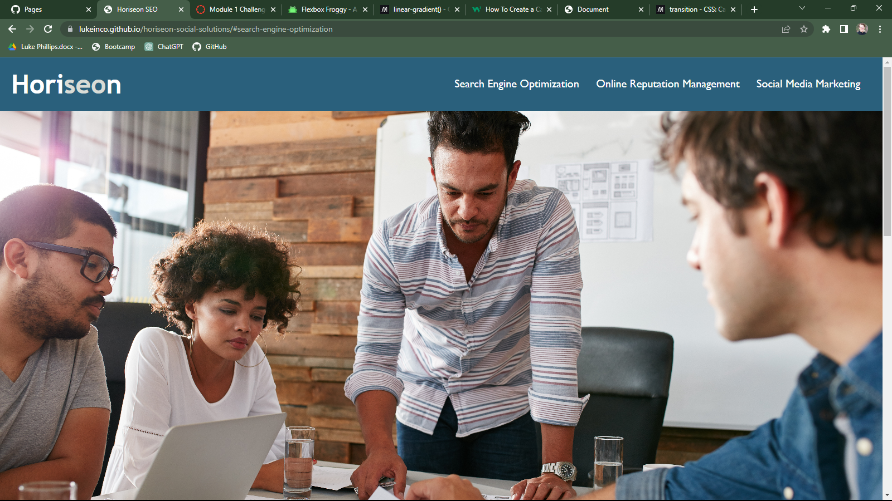

# Horiseon

## User Story
AS A marketing agency

I WANT a codebase that follows accessibility standards

SO THAT our own site is optimized for search engines

## My changes
I cleaned the source code by condensing the CSS, added ALT to images for accessibility, transformed the HTML into semantic HTML, and added a title.

https://lukeinco.github.io/horiseon-social-solutions/#search-engine-optimization

